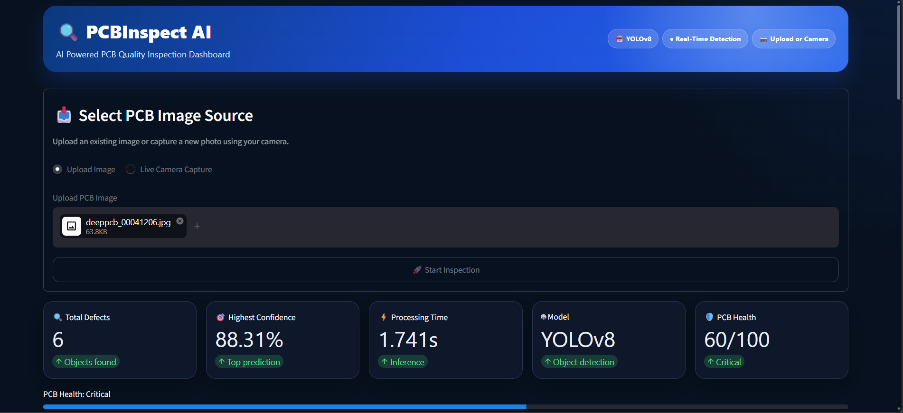
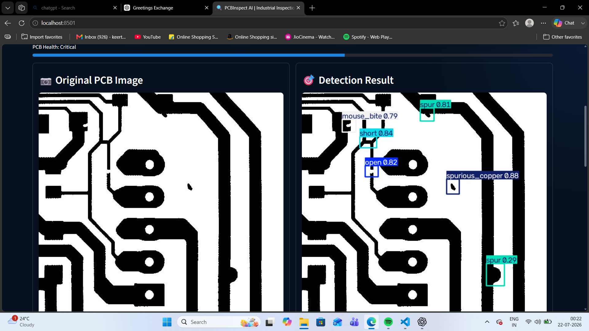
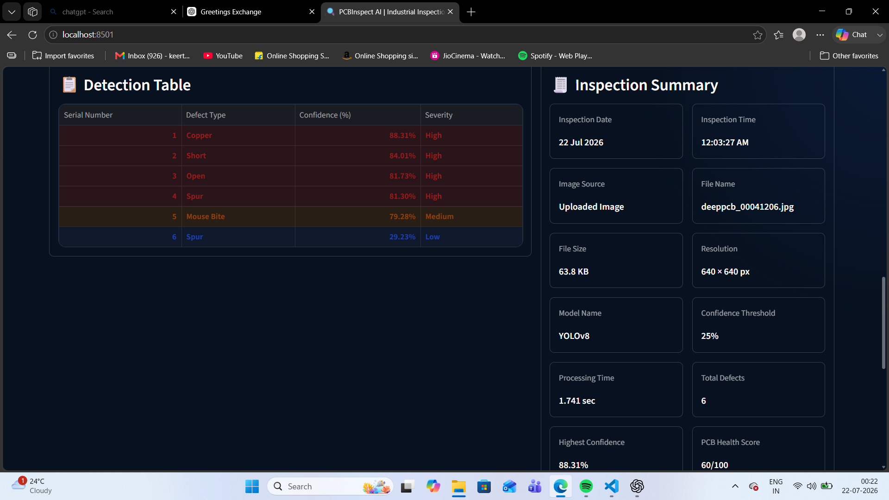

# 🔍 PCBInspect AI

<div align="center">

### AI-Powered Industrial PCB Defect Detection System

Detect Printed Circuit Board (PCB) defects in real-time using **YOLOv8**, **Computer Vision**, and an interactive **Streamlit Dashboard**.


---

**Industrial AI Dashboard for Automated PCB Quality Inspection**

</div>

---

# 📌 Overview

PCBInspect AI is an AI-powered industrial inspection system designed to automatically detect manufacturing defects on Printed Circuit Boards (PCBs).

The application combines **YOLOv8 object detection**, **OpenCV image processing**, and a **modern Streamlit dashboard** to provide fast, accurate, and interactive PCB inspection.

Instead of manually inspecting circuit boards, users can upload a PCB image (or capture one using a camera), and the system automatically:

- Detects PCB defects
- Draws bounding boxes
- Calculates confidence scores
- Displays inspection statistics
- Generates analytical charts
- Exports inspection reports (CSV & PDF)

The dashboard is designed to resemble an industrial quality inspection system used in electronics manufacturing.

---

# ✨ Features

✅ Industrial Dark-Themed Dashboard

✅ YOLOv8 Real-Time Object Detection

✅ Upload Image or Camera Capture

✅ Side-by-Side Image Comparison

✅ PCB Health Score

✅ Detection Confidence Analysis

✅ Severity Classification

✅ Detection Summary Table

✅ Interactive Charts

- Bar Chart
- Pie Chart

✅ Download Detection Image

✅ Export CSV Report

✅ Generate Professional PDF Report

✅ Responsive Streamlit UI

---

# 🎯 Defects Detected

The trained model detects the following PCB manufacturing defects:

| Class | Description |
|--------|-------------|
| Open | Broken electrical connection |
| Short | Unwanted electrical connection |
| Mouse Bite | Missing material on PCB edge |
| Spur | Small unwanted copper projection |
| Copper | Excess copper defect |
| Pin Hole | Small hole in copper trace |

---
# 📸 Dashboard Preview

## Home Dashboard

> *(Save your screenshots inside an `assets/` folder and update the filenames if needed.)*

| Dashboard | Detection Results |
|------------|-------------------|
|  |  |

| Analytics | PDF Report |
|-----------|------------|
|  |  |

---

# 🏗️ System Architecture

```text
                PCB Image
                     │
                     ▼
             Streamlit Dashboard
                     │
                     ▼
             YOLOv8 Object Detector
                     │
                     ▼
      ┌────────────────────────────┐
      │ Detect PCB Defects         │
      │ • Open                     │
      │ • Short                    │
      │ • Mouse Bite               │
      │ • Spur                     │
      │ • Copper                   │
      │ • Pin Hole                 │
      └────────────────────────────┘
                     │
                     ▼
         Detection Statistics
                     │
        ┌────────────┴────────────┐
        ▼                         ▼
  Interactive Charts         PDF & CSV Reports
```

---

# 📂 Project Structure

```text
PCB-Defect-Detection-AI
│
├── app.py
├── requirements.txt
├── README.md
├── .gitignore
│
├── models/
│   └── best.pt
│
├── src/
│   └── detector.py
│
├── dataset/
│
├── reports/
│
├── outputs/
│
└── assets/
```

---

# ⚙️ Installation

## Clone the repository

```bash
git clone https://github.com/keerthy-gs/PCB-Defect-Detection-AI.git

cd PCB-Defect-Detection-AI
```

---

## Create Virtual Environment

### Windows

```bash
python -m venv .venv

.venv\Scripts\activate
```

### Linux / macOS

```bash
python3 -m venv .venv

source .venv/bin/activate
```

---

## Install Dependencies

```bash
pip install -r requirements.txt
```

---

## Run the Application

```bash
streamlit run app.py
```

The dashboard will open automatically in your default browser.

---

# 🛠️ Tech Stack

| Category | Technology |
|----------|------------|
| Language | Python |
| Deep Learning | YOLOv8 |
| Framework | Streamlit |
| Computer Vision | OpenCV |
| Charts | Matplotlib |
| Data Analysis | Pandas |
| PDF Reports | ReportLab |
| QR Code | qrcode |
| Model Training | Ultralytics |
# 📊 Model Performance

The PCB defect detection model is trained using a custom merged dataset of publicly available PCB inspection images.

The model is capable of detecting six different PCB defect categories in real time while maintaining fast inference speed.

### Supported Defect Classes

| Class | Status |
|--------|--------|
| Open | ✅ |
| Short | ✅ |
| Mouse Bite | ✅ |
| Spur | ✅ |
| Spurious Copper | ✅ |
| Missing Hole | ✅ | 

### Training Configuration

| Setting | Value |
|---|---|
| Model | YOLOv8n |
| Training images | 6,372 |
| Validation images | 1,511 |
| Image size | 640 × 640 |
| Batch size | 16 |
| Training method | Staged checkpoint fine-tuning |
| Total completed epochs | 53 |

### Final Validation Results

| Metric | Result |
|---|---:|
| Precision | 92.4% |
| Recall | 86.4% |
| mAP@50 | 92.3% |
| mAP@50–95 | 57.0% |
| Inference time | 2.3 ms per image |

---

# 🔄 Detection Pipeline

```text
Input PCB Image
        │
        ▼
Image Preprocessing
        │
        ▼
YOLOv8 Object Detection
        │
        ▼
Bounding Box Generation
        │
        ▼
Confidence Score Calculation
        │
        ▼
Dashboard Analytics
        │
        ├────────► Detection Table
        ├────────► Health Score
        ├────────► Charts
        ├────────► CSV Report
        └────────► PDF Report
```

---

# 🚀 Future Improvements

- 🎥 Live webcam inspection
- 📹 Real-time production line monitoring
- 🤖 PCB defect severity prediction
- 📈 Manufacturing analytics dashboard
- ☁️ Cloud deployment
- 📱 Mobile-friendly dashboard
- 🔍 Multi-PCB batch inspection
- 🧠 Defect trend analysis using AI

---

# 🤝 Contributing

Contributions are always welcome!

If you'd like to improve this project:

1. Fork the repository
2. Create a new feature branch
3. Commit your changes
4. Push to your branch
5. Open a Pull Request

---

# 👨‍💻 Author

**Keerthy GS**

Electronics and Communication Engineering (ECE)

Passionate about Artificial Intelligence, Computer Vision, Embedded Systems, and Software Development.

### Connect with me

- GitHub: https://github.com/keerthy-gs
- LinkedIn: https://www.linkedin.com/in/keerthy-g-s-8179a7344

---

# ⭐ Support

If you found this project useful,

please consider giving it a ⭐ on GitHub.

It helps others discover the project and motivates future improvements.

---

# 📄 License

This project is licensed under the **MIT License**.

Feel free to use, modify, and distribute this project for educational and research purposes.

---

<div align="center">

### ⭐ Thank you for visiting this repository! ⭐

Built with ❤️ using Python, YOLOv8, OpenCV and Streamlit.

</div>
